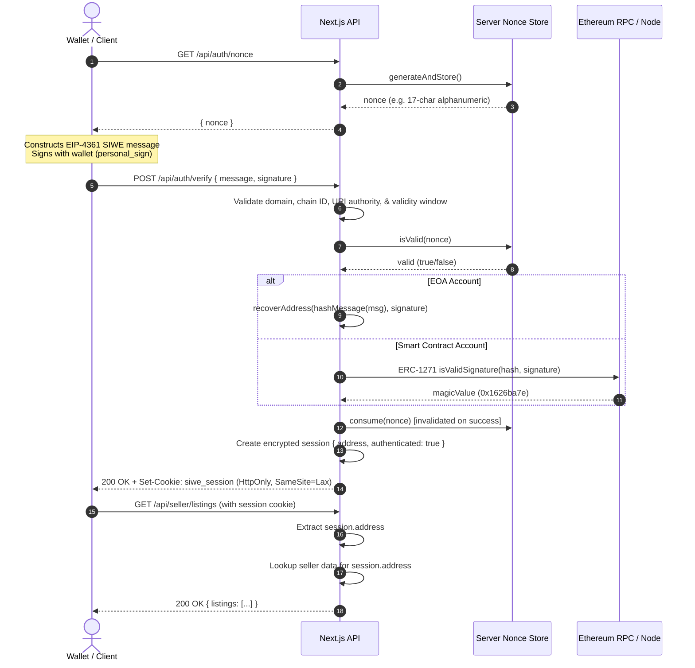

# SIWE Session Authentication 

A secure, production-pattern prototype implementing **Sign-In with Ethereum (SIWE / EIP-4361)** session authentication and role/seller authorization for Next.js App Router applications.

---

## 1. Project Purpose & Architecture

This prototype demonstrates how to authenticate users via Ethereum wallets using SIWE without trusting client-supplied addresses or wallet state. 

### Core Security Model

1. **Never trust client-reported addresses or client wallet connection state.**
2. **Server generates and stores nonces** with a finite Time-To-Live (TTL).
3. **Server cryptographically verifies SIWE signatures** (recovering the address for EOAs, or calling ERC-1271 `isValidSignature` for smart contract accounts).
4. **Server establishes an encrypted, HTTP-only cookie session** (`iron-session`) holding the verified address.
5. **Protected routes (e.g. seller listings and payout) authorize strictly from the server-side session address**, ignoring any client query parameters, headers, or request bodies.



---

## 2. Key Components

### A. Server-Side Nonce Management ([`src/lib/nonce.ts`](file:///home/blxnk/agy-workspace/siwe-auth/src/lib/nonce.ts))
- Nonces are generated server-side using cryptographically secure random alphanumeric strings (`siwe.generateNonce`).
- Stored in an in-memory store with configurable TTL (default: 300 seconds / 5 minutes).
- **Atomic consumption**: Failed verifications do NOT consume the nonce (allowing user to correct signatures or retry). Successful verifications consume the nonce immediately, preventing replay attacks and concurrent reuse.

### B. SIWE Verification & ERC-1271 Support ([`src/lib/verify.ts`](file:///home/blxnk/agy-workspace/siwe-auth/src/lib/verify.ts))
- **Domain & Chain ID**: Strictly compared against server-configured environment variables (`SIWE_DOMAIN`, `SIWE_CHAIN_ID`), independent of client headers.
- **URI Authority**: URI is validated to match the server's expected host/origin to prevent cross-origin phishing.
- **Validity Windows**: Checks `issuedAt`, `expirationTime`, and `notBefore` against server time.
- **EOA Signature Verification**: Uses `viem.recoverAddress` with `hashMessage(preparedMessage)` to recover and compare the checksummed address.
- **ERC-1271 Smart Contract Accounts**: If EOA recovery does not match (or for smart contract wallets like Safe), queries the contract's `isValidSignature(bytes32,bytes)` method on-chain, requiring the standard `0x1626ba7e` magic value.

### C. Server-Side Session Authentication ([`src/lib/session.ts`](file:///home/blxnk/agy-workspace/siwe-auth/src/lib/session.ts))
- Built with `iron-session` using AES-256-GCM encrypted cookies.
- Cookie attributes: `httpOnly: true`, `sameSite: "lax"`, `secure: process.env.NODE_ENV === "production"`, `maxAge: 24 hours`.
- Session address is set **strictly** from the verified cryptographic return value, ignoring any client-provided address parameters.

### D. Protected Seller Routes ([`src/app/api/seller/*`](file:///home/blxnk/agy-workspace/siwe-auth/src/app/api/seller/listings/route.ts))
- [`requireAuth()`](file:///home/blxnk/agy-workspace/siwe-auth/src/lib/auth-guard.ts) enforces active session authentication.
- Endpoints (`/api/seller/listings`, `/api/seller/payout`) look up seller data purely from `session.address`.
- Client query parameters (e.g. `?address=0x...`), headers (e.g. `X-Seller-Address`), or bodies cannot override or inject session identity.
- Unauthenticated requests receive `401 Unauthorized`.
- Non-seller addresses receive `404 Not Found` without data leakage.

---

## 3. Environment Variables

Create a `.env.local` file based on `.env.example`:

```bash
# Server Domain & Origin Configuration
SIWE_DOMAIN="localhost:3000"
SIWE_ORIGIN="http://localhost:3000"
SIWE_CHAIN_ID="1"
SIWE_STATEMENT="Sign in with Ethereum to the application."
NONCE_TTL_SECONDS="300"

# Iron-Session Password (minimum 32 characters in production)
SESSION_PASSWORD="replace_with_a_secure_session_password_at_least_32_chars_long"

# Blockchain RPC Configuration (Optional for live ERC-1271 resolution)
# RPC_URL_MAINNET="https://eth-mainnet.g.alchemy.com/v2/YOUR_API_KEY"
# RPC_URL_SEPOLIA="https://eth-sepolia.g.alchemy.com/v2/YOUR_API_KEY"
```

---

## 4. Getting Started

### Installation
```bash
npm install
```

### Running Tests
Execute the automated test suite covering all 9 challenge criteria:
```bash
npm test
```

### Typecheck & Build
```bash
npm run typecheck
npm run build
```

### Running the Local Demo
```bash
npm run dev
```
Open [http://localhost:3000](http://localhost:3000) in your browser.

---

## 5. Demo Flow

1. **Connect Wallet**: Click "Connect Wallet" to connect an injected browser wallet (e.g. MetaMask, Rabby, Coinbase Wallet).
2. **Sign In With Ethereum**: Click "Sign-In with Ethereum (SIWE)". The client fetches a fresh server nonce, constructs the SIWE message, and prompts wallet signature.
3. **Session Verification**: The signature is verified on the server, issuing an encrypted session cookie.
4. **Seller Dashboard**: The dashboard loads listings and payout info authorized strictly for your session's address. (Pre-configured seller addresses: Alice `0xf39Fd6e51aad88F6F4ce6aB8827279cffFb92266`, Bob `0x70997970C51812dc3A010C7d01b50e0d17dc79C8`).
5. **Log Out**: Click "Log Out" to destroy the session cookie and clear state.

---

## 6. Prototype Limitations & Production Considerations

- **In-Memory Nonce Storage**: The current nonce store uses a single-process in-memory `Map`. For multi-instance / autoscaling production deployments, use a distributed store with atomic TTL operations (such as Redis `SET key val EX 300 NX` and atomic `DEL`).
- **Mock Seller Database**: Seller records are statically modeled in-memory for demonstration. In production, link verified Ethereum addresses to a persistent database (PostgreSQL, etc.).
- **CSRF Consideration**: While `SameSite=Lax` cookies protect against cross-site POST requests in modern browsers, production applications with cross-origin APIs or custom subdomains should implement anti-CSRF tokens or explicit origin checks.
- **RPC Rate Limits**: ERC-1271 verification requires an RPC endpoint for the specified chain. In production, ensure high-availability RPC providers with fallbacks.
