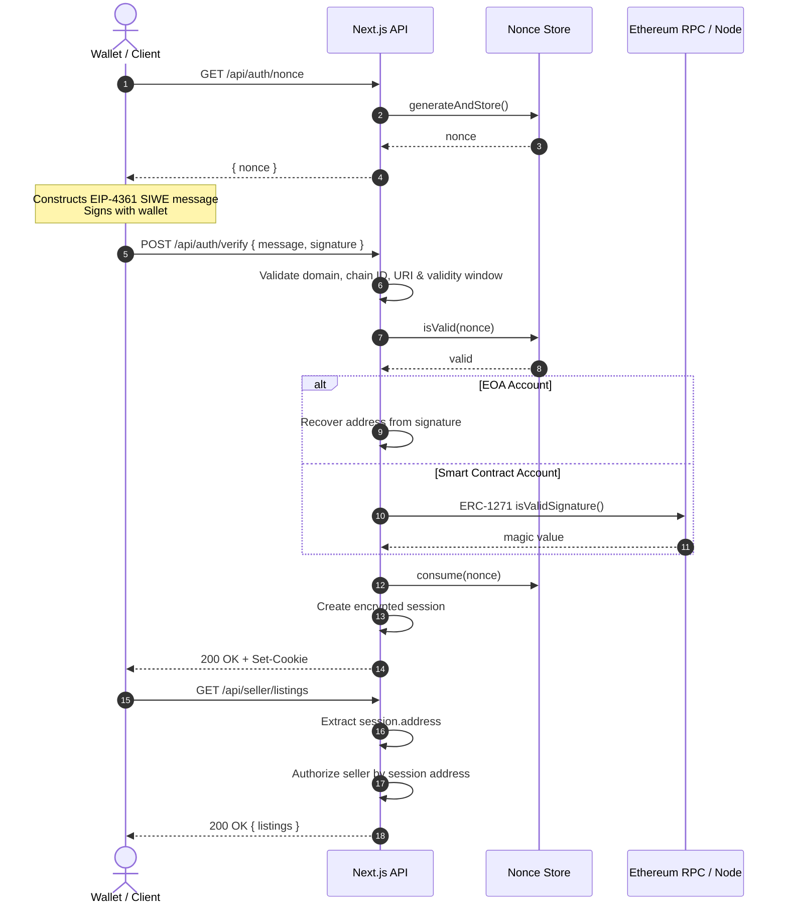

# SIWE Session Authentication

A secure, server-verified implementation of **Sign-In with Ethereum (SIWE / EIP-4361)** session authentication with seller authorization for Next.js App Router applications.

The system is designed around a simple security principle: **wallet state and client-supplied addresses are never treated as proof of identity**. Authentication is established only after the server validates the SIWE message, verifies its signature, and creates a server-controlled session.

---

## 1. Architecture

The authentication flow consists of four primary stages:

1. The server generates a cryptographically secure nonce with a finite lifetime.
2. The client constructs an EIP-4361 SIWE message containing the server-issued nonce and requests a wallet signature.
3. The server validates the SIWE message and cryptographically verifies the signature for either an externally owned account (EOA) or an ERC-1271 smart contract account.
4. A verified Ethereum address is stored in an encrypted, HTTP-only session cookie and becomes the sole source of identity for protected routes.

### Core Security Model

* **Never trust client-reported wallet addresses or connection state.**
* **Generate authentication nonces exclusively on the server.**
* **Enforce nonce expiration and single-use consumption.**
* **Validate SIWE domain, URI, chain ID, and validity timestamps server-side.**
* **Verify signatures cryptographically rather than trusting the supplied address.**
* **Support both EOAs and ERC-1271 smart contract accounts.**
* **Derive authorization exclusively from the verified server-side session.**
* **Prevent request parameters, headers, or bodies from overriding the authenticated identity.**
* **Use encrypted, HTTP-only cookies for session state.**



---

## 2. Authentication Flow

### 2.1 Server-Generated Nonce

The client first requests a nonce from:

```text
GET /api/auth/nonce
```

The server generates the nonce and stores it with a configurable TTL.

Nonces are:

* Generated server-side using `siwe.generateNonce`
* Cryptographically unpredictable
* Valid only for a limited period
* Associated with a single authentication attempt
* Consumed after successful verification

A failed signature verification does **not** consume the nonce, allowing the same authentication attempt to be retried. Once verification succeeds, the nonce is consumed immediately to prevent replay and concurrent reuse.

---

### 2.2 SIWE Message Validation

The client constructs an EIP-4361 message containing the server-issued nonce and requests a signature from the connected wallet.

Before accepting the signature, the server validates:

* SIWE domain
* Expected application origin / URI
* Chain ID
* Nonce
* Issued-at timestamp
* Expiration time
* Not-before timestamp
* Message structure

These values are checked against server-side configuration rather than being trusted from the client.

---

### 2.3 Signature Verification

The server supports both major Ethereum account types.

#### Externally Owned Accounts

For EOAs, the server:

1. Hashes the SIWE message using Ethereum's message-signing format.
2. Recovers the Ethereum address from the signature.
3. Compares the recovered address with the address contained in the SIWE message.

The recovered address is treated as the authenticated identity.

#### Smart Contract Accounts

For contract-based wallets such as Safe, the server supports **ERC-1271**.

The signature is verified by calling:

```text
isValidSignature(bytes32 hash, bytes signature)
```

The verification succeeds only when the contract returns the ERC-1271 magic value:

```text
0x1626ba7e
```

This allows authentication to work with both traditional EOAs and smart contract wallets.

---

## 3. Session Management

After successful signature verification, the server creates an encrypted session using `iron-session`.

The session contains the **server-verified Ethereum address**, rather than accepting an address supplied independently by the client.

### Cookie Configuration

The session cookie is configured with:

```text
httpOnly: true
sameSite: "lax"
secure: true in production
maxAge: 24 hours
```

This prevents client-side JavaScript from directly accessing the session cookie and provides browser-level protection against common cross-site request scenarios.

The resulting authentication model is:

```text
Wallet Signature
       ↓
Server Verification
       ↓
Verified Ethereum Address
       ↓
Encrypted Session
       ↓
Protected API Routes
```

---

## 4. Authorization

Authentication and authorization are separated.

Authentication establishes **who the user is**.

Authorization determines **what that authenticated user can access**.

Protected seller endpoints use a shared `requireAuth()` guard to ensure an active authenticated session exists.

For example:

```text
GET /api/seller/listings
GET /api/seller/payout
```

Both routes derive the user's identity exclusively from:

```text
session.address
```

They do **not** use:

```text
?address=...
X-Seller-Address: ...
request body address
client wallet state
```

This prevents an authenticated user from changing the target address in a request and accessing another seller's resources.

### Authorization Flow

```text
Request
   │
   ▼
Session Cookie
   │
   ▼
Authenticated?
   │
   ├── No → 401 Unauthorized
   │
   ▼
session.address
   │
   ▼
Seller Lookup
   │
   ├── Not a seller → 404
   │
   ▼
Authorized Seller Data
```

---

## 5. Key Components

### Nonce Management

[`src/lib/nonce.ts`](src/lib/nonce.ts)

Responsible for:

* Server-side nonce generation
* TTL enforcement
* Nonce validation
* Atomic successful consumption
* Replay prevention

The default nonce lifetime is **300 seconds (5 minutes)**.

---

### SIWE & Signature Verification

[`src/lib/verify.ts`](src/lib/verify.ts)

Responsible for:

* EIP-4361 message validation
* Domain validation
* URI/origin validation
* Chain ID validation
* Timestamp validation
* EOA signature recovery
* ERC-1271 contract-wallet verification

---

### Session Management

[`src/lib/session.ts`](src/lib/session.ts)

Responsible for:

* Creating authenticated sessions
* Encrypting session state
* Configuring cookie security attributes
* Destroying sessions during logout

---

### Authentication Guard

[`src/lib/auth-guard.ts`](src/lib/auth-guard.ts)

Provides a shared authentication boundary for protected API routes.

Routes use the guard before accessing seller-specific resources.

---

### Seller Routes

[`src/app/api/seller/*`](src/app/api/seller/)

Seller endpoints authorize requests using the address contained in the verified session.

Client-controlled identity values cannot override the session identity.

---

## 6. Environment Configuration

Create `.env.local` using `.env.example` as a reference:

```bash
# Server Domain & Origin
SIWE_DOMAIN="localhost:3000"
SIWE_ORIGIN="http://localhost:3000"
SIWE_CHAIN_ID="1"
SIWE_STATEMENT="Sign in with Ethereum to the application."

# Nonce Lifetime
NONCE_TTL_SECONDS="300"

# Session Encryption
SESSION_PASSWORD="replace_with_a_secure_session_password_at_least_32_chars_long"

# Blockchain RPC
# Required when verifying ERC-1271 smart contract accounts.
# RPC_URL_MAINNET="https://eth-mainnet.g.alchemy.com/v2/YOUR_API_KEY"
# RPC_URL_SEPOLIA="https://eth-sepolia.g.alchemy.com/v2/YOUR_API_KEY"
```

For deployment, `SESSION_PASSWORD` must be a strong, randomly generated secret and must never be committed to source control.

---

## 7. Getting Started

### Install Dependencies

```bash
npm install
```

### Run Tests

```bash
npm test
```

The test suite covers the authentication and authorization security requirements implemented by the application.

### Typecheck

```bash
npm run typecheck
```

### Build

```bash
npm run build
```

### Start Development Server

```bash
npm run dev
```

The application will be available at:

```text
http://localhost:3000
```

---

## 8. Authentication Demo

### Connect Wallet

Connect an injected Ethereum wallet such as MetaMask, Rabby, or Coinbase Wallet.

### Sign In

Select **Sign-In with Ethereum (SIWE)**.

The client requests a fresh nonce from the server, constructs the SIWE message, and requests a wallet signature.

### Server Verification

The server validates the message and verifies the signature.

A successful verification creates an encrypted session containing the verified Ethereum address.

### Seller Authorization

The seller dashboard retrieves listings and payout information using the authenticated session address.

The application includes predefined seller accounts for demonstrating authorization behavior.

### Logout

Logging out destroys the server session and clears the authentication cookie.

---

## 9. Security Considerations

### Distributed Nonce Storage

The current nonce implementation uses an in-memory store. A multi-instance deployment should use a shared datastore with atomic TTL and consumption semantics, such as Redis.

A distributed store ensures that authentication state remains consistent when requests are handled by different application instances.

### Session Secret Management

The session encryption secret must be:

* Strong and randomly generated
* Stored outside source control
* Provided through a secure deployment secret mechanism
* Consistent across application instances

### CSRF Protection

`SameSite=Lax` provides useful browser-level protection for the session cookie. Applications using cross-origin APIs, custom subdomains, or more complex cookie flows should additionally enforce trusted origins and, where appropriate, use explicit CSRF protection.

### ERC-1271 RPC Availability

Smart contract wallet authentication depends on access to an Ethereum RPC endpoint. Production deployments should use reliable RPC infrastructure and account for provider failures and rate limits.

---

## 10. Security Properties

The implementation is designed to provide the following guarantees:

| Property                       | Mechanism                                                |
| ------------------------------ | -------------------------------------------------------- |
| Address authenticity           | Cryptographic signature verification                     |
| Replay resistance              | Server-generated, expiring, single-use nonces            |
| Domain binding                 | Server-side SIWE domain validation                       |
| Chain binding                  | Server-side chain ID validation                          |
| Origin validation              | Server-side URI/origin verification                      |
| Time-bound authentication      | `issuedAt`, `expirationTime`, and `notBefore` validation |
| EOA support                    | Ethereum signature recovery                              |
| Smart wallet support           | ERC-1271 verification                                    |
| Session confidentiality        | Encrypted session cookie                                 |
| Client-side session protection | HTTP-only cookie                                         |
| Seller authorization           | Server-side session address                              |
| Identity injection prevention  | Client address parameters ignored                        |
| Session lifetime               | Explicit cookie expiration                               |
| Logout                         | Server-side session destruction                          |

---

## 11. Design Principle

The central security boundary is:

```text
Client-supplied identity
        ↓
     NEVER TRUST
        ✕
        
Wallet signature
        ↓
Server-side verification
        ↓
Verified Ethereum address
        ↓
Encrypted session
        ↓
Authorization
```

The wallet connection establishes the **ability to request authentication**.

The server-side verification establishes the **authenticated identity**.

Every protected operation then derives authorization from that verified identity rather than from information supplied by the client.
